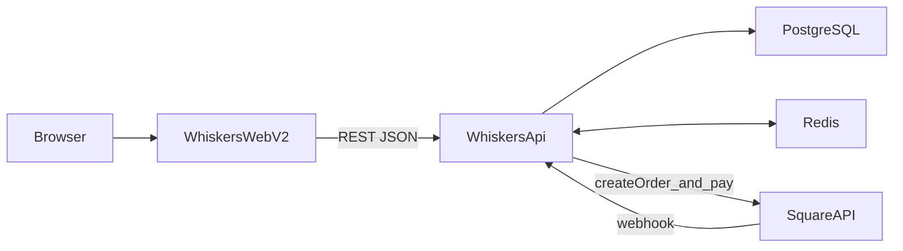

# Whiskers V2 全栈电商实施计划（plan.md）

> 目标：把 v1（Next.js + Contentful 纯前端原型）升级为 v2（React SPA + NestJS + PostgreSQL + Redis + Square）

---

## 0) MVP 范围（先做什么 / 不做什么）

### MVP（必须做）

- **商品浏览**：口味列表 / 详情 / 分类
- **今日菜单**：公开可访问
- **购物车**：增删改数量 + 价格计算
- **下单（仅 Guest Checkout）**：匿名创建订单（收集 email / phone）
- **支付（Square Sandbox）**：创建支付 / 跳转支付 / webhook 回调更新订单为 PAID
- **基础管理端（Staff+）**：
  - 口味 CRUD
  - 今日菜单设置（上架/下架 + 排序）
  - 订单列表 + 状态更新（PREPARING/READY/COMPLETED/CANCELLED）
- **部署上线**：Docker + Nginx + Lightsail（含 HTTPS）

### 非 MVP（先不做 / 后续增强）

- 优惠券完整业务（MVP 仅保留 DB 结构，不实现 API / UI）
- 复杂库存管理（先用 isActive / 今日菜单控制“可买”）
- 多支付渠道（Apple Pay/Google Pay 依赖 Square 能力，后续补充说明即可）
- SEO 深度优化（SPA 可以做基础 Lighthouse 与性能优化，SEO 做到“可讲”即可）

---

## 1) 架构概览




### 技术栈

- **Frontend**：React 19 + Vite + TypeScript + Tailwind + React Router v7 + Zustand + TanStack Query + Axios
- **Backend**：NestJS + TypeScript + Prisma + JWT/Passport + class-validator + Swagger + Redis
- **Data**：PostgreSQL + Redis
- **Payments**：Square（Sandbox + webhook，ngrok 本地联调）
- **Deploy**：Docker Compose + Nginx + AWS Lightsail
- **CI/CD**：Jenkins Pipeline（执行 lint/test，后端单元测试覆盖率 ≥ 85% 后才允许部署）

---

## 2) 仓库结构（建议：同仓库内双项目）

目标结构：

```
whiskers-e-comm/
├── whiskers-api/
├── whiskers-web-v2/
├── docker-compose.yml          # dev: postgres + redis
├── docker-compose.prod.yml     # prod: add nginx + app containers
├── plan.md
└── README.md
```

---

## 3) Phase 1：项目初始化（环境可跑）

### 3.1 Repo/工程初始化

- 创建目录：`whiskers-api/`、`whiskers-web-v2/`
- 后端初始化（NestJS）
- 前端初始化（Vite React-TS）
- 代码质量：ESLint/Prettier/TypeScript 配置（前后端各自）
- 在根目录准备 `docker-compose.yml`（postgres + redis）

### 3.2 验收标准

- `docker compose up` 后 Postgres/Redis 正常运行
- Prisma 能连上数据库
- 后端能响应 `/api/health`
- 前端能启动并展示占位首页

---

## 4) Phase 2：后端核心（Auth / Flavours / Menu / Admin / Audit）

### 4.0 测试优先策略（推荐）

> 原则：**业务规则先测、接口后补**。最先写测试的部分集中在「最容易出错且返工成本高」的业务域：订单金额、状态机、Webhook 幂等。

- **先写单元测试（Service/Domain）**：
  - 订单金额计算（含未来 coupon 扩展点）
  - 订单状态机（允许/拒绝的状态流转）
  - webhook 幂等（重复事件不重复更新/不产生副作用）
- **少量集成测试**（后置一点，但在支付联调前补齐）：
  - Prisma + Postgres：创建订单/更新状态
  - Redis：菜单缓存 set/get + 菜单更新时失效

### 4.1 Prisma Schema 定稿与迁移

- `User`（含 role/isActive）
- `Profile`（phone/address 可选）
- `Category` / `Flavour`（多对多）
- `Menu`（今日供应 + 排序）
- `Order`（支持 `userId` 可选 + `guestEmail/guestPhone`）
- `OrderItem`
- `Coupon`（可先保留结构）
- `AuditLog`

执行：

- 初始迁移：`prisma migrate dev`（命名约定写进 README）

### 4.2 通用基础设施（common）

- 统一错误响应：全局异常过滤器
- JWT 守卫：`JwtAuthGuard`
- RBAC：`RolesGuard` + `@Roles()`（STAFF/ADMIN）
- Swagger：自动生成 API 文档（并注明如何访问）
- PrismaService：应用生命周期与连接管理
- AuditService：关键操作写入 `AuditLog`

### 4.3 Auth 模块（JWT）

- `POST /api/auth/register`
- `POST /api/auth/login`
- `POST /api/auth/logout`
- `GET /api/auth/me`
- `POST /api/auth/refresh`

实现要点：

- 密码 bcrypt
- Token 刷新策略（refresh token 存储方式在此明确：DB 或 Redis）
- 角色与权限拦截（管理端接口）

### 4.4 Flavours / Categories / Menu

Flavours：

- `GET /api/flavours`（公开，支持分页/筛选）
- `GET /api/flavours/today`（公开）
- `GET /api/flavours/:id`（公开）
- `POST /api/flavours`（Staff+）
- `PATCH /api/flavours/:id`（Staff+）
- `DELETE /api/flavours/:id`（Staff+）

Menu：

- `GET /api/menu`（公开）
- `POST /api/menu`（Staff+，更新整份菜单）
- `PATCH /api/menu/today`（Staff+，设置今日供应）

Redis 使用（明确写在实现中）：

- 今日菜单缓存（高频读、低频写）
- 菜单更新时主动失效缓存

### 4.5 Admin

- `GET /api/admin/users`（Admin）
- `PATCH /api/admin/users/:id`（Admin）
- `GET /api/admin/audit-logs`（Staff+，分页）

### 4.6 验收标准

- Auth 流程可用（注册/登录/me/刷新）
- Staff+ 的口味 CRUD 可用（并写入审计日志）
- 今日菜单可读、可更新，且 Redis 缓存生效
- Admin 用户管理可用
- 关键业务规则有测试覆盖（至少：订单状态机 / 金额计算 的单元测试）

---

## 5) Phase 3：订单与 Square 支付（全链路跑通）

### 5.0 TDD：OrderDomain（先测再写）

> 这一步的目标是把“最核心、最容易翻车”的规则先固定下来，避免后续接入 Square webhook 时一边联调一边改规则。

- **OrderTotal 计算**（单元测试）
  - items 合计：\u2211 price \u00d7 quantity
  - quantity 规则：必须为正整数
  - price 规则：来自服务端 Flavour 当前价格（不信任前端传入）
  - coupon 扩展点（如果暂不做 coupon：先写 TODO 测试用例占位即可）
- **订单状态机**（单元测试）
  - 允许：PENDING->PAID->PREPARING->READY->COMPLETED
  - 允许：任意状态 -> CANCELLED（按你实现约束决定是否限制）
  - 拒绝：跳跃式流转（例如 PENDING->READY）
- **Webhook 幂等**（单元测试/轻集成测试）
  - 相同 payment/event 重放：只更新一次订单状态
  - 已 PAID 的订单再次收到 COMPLETED：不重复写入/不降级状态

### 5.0.5 Sandbox 本地联调步骤

- 在 Square Dashboard 创建 Sandbox 应用
  - 记录：`SQUARE_ACCESS_TOKEN`、`SQUARE_LOCATION_ID`
  - 填写到 `.env`，并在 README 里说明
- 配置 Square Webhook
  - 启动后端本地服务（假设端口 `3000`）
  - 使用 `ngrok http 3000` 暴露本地
  - 在 Square 后台把 webhook URL 指向：`https://<ngrok>/api/orders/webhook`
  - 只勾选需要的事件（例如 `payment.updated`）
- 跑一遍完整 Sandbox 流程（手动 E2E）
  - 前端下单 → 后端创建订单 → 跳转 Sandbox 支付页
  - 在 Sandbox 完成支付
  - 检查 webhook 日志与应用日志，确认订单状态从 PENDING → PAID

### 5.1 订单状态机

```
PENDING -> PAID -> PREPARING -> READY -> COMPLETED
   |
   v
CANCELLED
```

- 订单创建：校验口味是否在售、价格、数量；计算 total；落库
- Guest Checkout：允许匿名下单，仅收集 guestEmail/guestPhone

### 5.2 支付 API

- `POST /api/orders`（创建订单）
- `POST /api/orders/:id/pay`（创建 Square 支付，返回支付链接/支付信息）
- `POST /api/orders/webhook`（处理 Square webhook，幂等更新订单为 PAID）

Webhook 安全与幂等：

- webhook 校验（签名/secret 至少一种）
- 幂等处理（Redis 或 DB 约束）

### 5.3 验收标准

- Square Sandbox 配置完成
- 能从后端创建支付并拿到可跳转链接
- 完成支付后 webhook 能把订单状态更新为 PAID
- 重复 webhook 不会造成重复写入/状态错乱
- 支付相关关键规则有测试覆盖（至少：状态机 + webhook 幂等）

---

## 6) Phase 4：前端（用户端 + 管理端）

### 6.1 路由与页面

- `/` 首页
- `/flavours` 口味列表（公开）
- `/flavours/:id` 口味详情（公开）
- `/today` 今日供应（公开）
- `/cart` 购物车（公开）
- `/checkout` 结账（公开，支持 guest 填信息）
- `/orders` 订单历史（登录）
- `/profile` 个人中心（登录）
- `/admin` 管理后台（Staff+）
- `/login` 登录

### 6.2 状态管理与数据请求

Zustand：

- `cartStore`：items + add/remove/updateQuantity/clear/getTotal
- `authStore`：user/token + login/logout/refresh

TanStack Query：

- `useFlavours` / `useFlavour(id)` / `useTodayMenu`
- `useCreateOrder` / `usePayOrder(orderId)` / `useOrders`

Axios：

- 统一 `services/api.ts`，请求拦截器自动带 token

### 6.3 关键用户流程验收

- 浏览口味 → 加入购物车 → 结账 → 创建订单 → 去支付（跳 Square）
- 支付完成后：能在订单历史/订单详情看到状态更新
- 管理端：可 CRUD 口味、设置今日供应、更新订单状态

---

## 7) Phase 5：部署（Lightsail）

### 7.1 容器化与反向代理

- 后端 `Dockerfile`（build + prisma generate + run）
- 前端 `Dockerfile`（build + Nginx 托管静态资源）
- `docker-compose.prod.yml`（frontend/backend/postgres/redis/nginx）
- Nginx：`/api` 代理到 backend，其余到 frontend

### 7.2 HTTPS 与域名

- Lightsail 开放端口 80/443/22
- certbot 申请证书并自动续期

### 7.3 CI/CD（Jenkins Pipeline）

- Jenkins 触发条件：main 分支 push 或手动构建
- Pipeline 步骤：lint → 后端单元测试（要求覆盖率 ≥ 85%）→ 构建镜像 → SSH 到服务器 → `docker compose pull && docker compose up -d`
- 整理 Jenkins 配置与凭据清单（服务器 SSH 信息、镜像仓库凭据等）

### 7.4 验收标准

- 域名可访问，HTTPS 正常
- 前后端都可用，/api 正常代理
- CI/CD 可自动部署

---

## 8) Phase 6：测试、优化、文档与作品集包装

### 8.1 测试

- 后端：Jest 单元测试（核心业务）+ E2E（关键端点）
- 后端单元测试覆盖率目标：整体 ≥ 85%，核心业务（订单金额、状态机、Webhook 幂等）优先保证
- 前端：Playwright（关键链路）
- API：Postman Collection / Newman（可选但加分）

### 8.2 性能与体验

- 前端：路由级代码分割、图片懒加载、React Query 缓存策略
- 后端：索引优化、压缩、缓存策略完善

### 8.3 文档

- README：本地启动、环境变量、迁移、测试、部署、架构图
- Swagger：如何访问与使用
- 面试讲解笔记（可选）：技术选型、trade-offs、踩坑点（Square webhook/幂等/RBAC/缓存）

---

## 9) 里程碑（建议时间）

> 实际个人计划：核心 MVP 目标在 3–4 天内完成（最多宽限到 5 天），上面的 Week 划分可视为“理想化教学版时间轴”。

- Week 1-2：Phase 1（环境 + 双项目初始化）
- Week 3-6：Phase 2（后端核心）
- Week 7-8：Phase 3（Square 支付全链路）
- Week 9-12：Phase 4（前端用户端 + 管理端）
- Week 13：Phase 5（部署 + CI/CD）
- Week 14：Phase 6（测试/优化/文档/包装）

