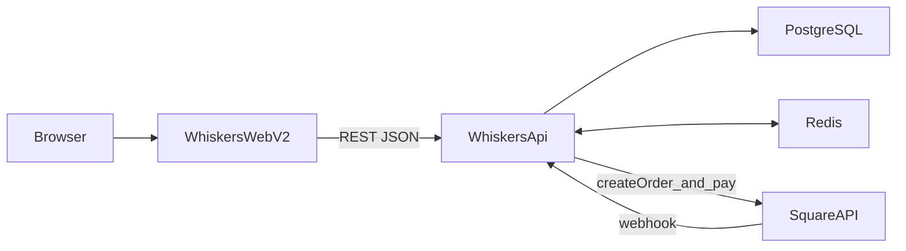

# Whiskers V2 Full-Stack Implementation Plan (plan_en.md)

> Goal: Upgrade Whiskers from v1 (Next.js + Contentful front-end prototype) to v2 (React SPA + NestJS + PostgreSQL + Redis + Square) as a project that can run locally and be deployed.

---

## 0) MVP Scope (What’s In / What’s Out)

### MVP (Must-Have)

- [ ] **Catalog browsing**: flavour list / detail / categories
- [ ] **Today’s menu**: publicly accessible
- [ ] **Cart**: add / remove / update quantity + price calculation
- [ ] **Checkout**: create order (with Guest Checkout support)
- [ ] **Payment (Square Sandbox)**: create payment / redirect to checkout / webhook updates order to PAID
- [ ] **Basic admin (Staff+)**:
  - [ ] Flavour CRUD
  - [ ] Today’s menu management (toggle availability + sorting)
  - [ ] Order list + status updates (PREPARING/READY/COMPLETED/CANCELLED)
- [ ] **Deployment**: Docker + Nginx + Lightsail (with HTTPS)

### Non-MVP (Nice-to-Have / Later)

- [ ] Full coupon business logic (keep DB structure & hooks if you like, but UI & flows can be post-MVP)
- [ ] Rich inventory management (start with `isActive` + today’s menu as “is sellable”)
- [ ] Multiple payment methods (Apple Pay / Google Pay depend on Square; can be described in docs)
- [ ] Deep SEO optimization (SPA with decent Lighthouse and perf is enough; focus on “can explain”)

---

## 1) Architecture Overview



### Tech Stack (Aligned with `suggestion.md`)

- **Frontend**: React 19 + Vite + TypeScript + Tailwind + React Router v7 + Zustand + TanStack Query + Axios
- **Backend**: NestJS + TypeScript + Prisma + JWT/Passport + class-validator + Swagger + Redis
- **Data**: PostgreSQL + Redis
- **Payments**: Square (Sandbox + webhooks, local testing via ngrok)
- **Deploy**: Docker Compose + Nginx + AWS Lightsail
- **CI/CD**: Jenkins pipeline running lint + backend test suite, enforcing ≥ 85% backend unit test coverage before deployment.

---

## 2) Repo Structure (Single Repo, Two Apps)

Target structure:

```text
whiskers-e-comm/
├── whiskers-api/
├── whiskers-web-v2/
├── docker-compose.yml          # dev: postgres + redis
├── docker-compose.prod.yml     # prod: add nginx + app containers
├── plan.md
├── plan_en.md
└── README.md
```

---

## 3) Phase 1: Project Bootstrap (Environment Running)

### 3.1 Repo / Project Setup

- [ ] Create directories: `whiskers-api/`, `whiskers-web-v2/`
- [ ] Backend: init NestJS app
- [ ] Frontend: init Vite React-TS app
- [ ] Code quality: ESLint / Prettier / TypeScript config (frontend & backend)
- [ ] Root `docker-compose.yml` (Postgres + Redis for dev)

### 3.2 Acceptance Criteria

- [ ] `docker compose up` starts Postgres & Redis successfully
- [ ] Prisma can connect to the database
- [ ] Backend responds on `/api/health`
- [ ] Frontend dev server starts and shows a placeholder home page

---

## 4) Phase 2: Backend Core (Auth / Flavours / Menu / Admin / Audit)

### 4.0 Test-First Strategy (Recommended)

> Principle: **test core business rules before wiring up controllers**. Focus tests on areas that are error-prone and expensive to change: order totals, state machine, and webhook idempotency.

- [ ] **Start with unit tests (service/domain layer)**:
  - [ ] Order total calculation (with future coupon extension points)
  - [ ] Order state machine (allowed / forbidden transitions)
  - [ ] Webhook idempotency (duplicate events do not cause duplicate updates or side effects)
- [ ] **A few integration tests** (added before full payment integration):
  - [ ] Prisma + Postgres: create order / update status
  - [ ] Redis: menu cache set/get + invalidation when menu changes

### 4.1 Prisma Schema Finalization & Migration

- [ ] `User` (with `role` and `isActive`)
- [ ] `Profile` (optional `phone` / `address`)
- [ ] `Category` / `Flavour` (many-to-many)
- [ ] `Menu` (today’s menu + sort order)
- [ ] `Order` (optional `userId` + `guestEmail` / `guestPhone`)
- [ ] `OrderItem`
- [ ] `Coupon` (can be kept as structure-only during MVP)
- [ ] `AuditLog`

Execution:

- [ ] Initial migration: `prisma migrate dev` (document naming convention in README)

### 4.2 Common Infrastructure

- [ ] Unified error response: global exception filter
- [ ] JWT guard: `JwtAuthGuard`
- [ ] RBAC: `RolesGuard` + `@Roles()` (STAFF/ADMIN)
- [ ] Swagger: auto-generated API docs (document how to access)
- [ ] `PrismaService`: DB connection & lifecycle management
- [ ] `AuditService`: log key operations into `AuditLog`

### 4.3 Auth Module (JWT)

Routes aligned with `suggestion.md`:

- [ ] `POST /api/auth/register`
- [ ] `POST /api/auth/login`
- [ ] `POST /api/auth/logout`
- [ ] `GET /api/auth/me`
- [ ] `POST /api/auth/refresh`

Implementation notes:

- [ ] Password hashing via bcrypt
- [ ] Token refresh strategy (decide where to store refresh tokens: DB or Redis)
- [ ] Role-based access control for admin / staff endpoints

### 4.4 Flavours / Categories / Menu

Flavours:

- [ ] `GET /api/flavours` (public, with pagination / filters)
- [ ] `GET /api/flavours/today` (public)
- [ ] `GET /api/flavours/:id` (public)
- [ ] `POST /api/flavours` (Staff+)
- [ ] `PATCH /api/flavours/:id` (Staff+)
- [ ] `DELETE /api/flavours/:id` (Staff+)

Menu:

- [ ] `GET /api/menu` (public)
- [ ] `POST /api/menu` (Staff+, update full menu)
- [ ] `PATCH /api/menu/today` (Staff+, mark today’s items)

Redis usage (make explicit in implementation):

- [ ] Cache today’s menu (high read / low write)
- [ ] Invalidate cache on menu updates

### 4.5 Admin

- [ ] `GET /api/admin/users` (Admin)
- [ ] `PATCH /api/admin/users/:id` (Admin)
- [ ] `GET /api/admin/audit-logs` (Staff+, paginated)

### 4.6 Acceptance Criteria

- [ ] Auth flow works (register / login / me / refresh)
- [ ] Staff+ users can manage flavours (CRUD) and changes are logged in `AuditLog`
- [ ] Today’s menu can be read and updated, with Redis cache in place
- [ ] Admin user management works
- [ ] Core business rules have unit tests (at minimum: order state machine + order total calculation)

---

## 5) Phase 3: Orders & Square Payments (End-to-End)

### 5.0 TDD: OrderDomain (Tests First)

> Goal: lock down the most critical, easy-to-break rules before wiring up Square webhooks, so you don’t debug rules and integration at the same time.

- [ ] **OrderTotal calculation** (unit tests)
  - [ ] Sum items: \(\sum price \times quantity\)
  - [ ] Quantity: positive integers only
  - [ ] Price: always use server-side flavour price (never trust client)
  - [ ] Coupon extension (if not implemented yet: add TODO-style tests as placeholders)
- [ ] **Order state machine** (unit tests)
  - [ ] Allow: PENDING -> PAID -> PREPARING -> READY -> COMPLETED
  - [ ] Allow: any -> CANCELLED (or restrict based on your design)
  - [ ] Reject: invalid jumps (e.g. PENDING -> READY)
- [ ] **Webhook idempotency** (unit / light integration)
  - [ ] Same payment/event replay: only one state update
  - [ ] Payment for an already PAID order (COMPLETED again): no duplicate changes or downgrades

### 5.0.5 Sandbox Local Integration Steps

- [ ] Create a Sandbox application in Square Dashboard
  - [ ] Note down: `SQUARE_ACCESS_TOKEN`, `SQUARE_LOCATION_ID`
  - [ ] Put them into `.env` and document them in README
- [ ] Configure Square webhook
  - [ ] Start backend locally (assume port `3000`)
  - [ ] Run `ngrok http 3000` to expose local server
  - [ ] In Square dashboard, set webhook URL to `https://<ngrok>/api/orders/webhook`
  - [ ] Enable only required events (e.g. `payment.updated`)
- [ ] Run a full Sandbox flow (manual E2E)
  - [ ] Place an order from frontend → backend creates order → redirect to Sandbox checkout
  - [ ] Complete payment in Sandbox
  - [ ] Check webhook logs and app logs: order should go from PENDING → PAID

### 5.1 Order State Machine

Aligned with `suggestion.md`:

```text
PENDING -> PAID -> PREPARING -> READY -> COMPLETED
   |
   v
CANCELLED
```

- [ ] Order creation: validate flavours are active & available, validate price & quantity, compute total, persist
- [ ] Guest Checkout: allow anonymous orders with `guestEmail` / `guestPhone`

### 5.2 Payment APIs

- [ ] `POST /api/orders` (create order)
- [ ] `POST /api/orders/:id/pay` (create Square payment, return checkout link / client details)
- [ ] `POST /api/orders/webhook` (handle Square webhook, idempotently update order to PAID)

Webhook security & idempotency:

- [ ] Webhook verification (signature or secret token at minimum)
- [ ] Idempotency logic (via Redis or DB constraints)

### 5.3 Acceptance Criteria

- [ ] Square Sandbox is configured correctly
- [ ] Backend can create a payment and return a valid redirect URL
- [ ] After payment succeeds, webhook updates the order from PENDING to PAID
- [ ] Replayed webhooks do not cause duplicate writes or inconsistent states
- [ ] Tests cover key payment rules (at least: state machine + webhook idempotency)

---

## 6) Phase 4: Frontend (Customer + Admin)

### 6.1 Routes & Pages

- [ ] `/` Home
- [ ] `/flavours` Flavour list (public)
- [ ] `/flavours/:id` Flavour detail (public)
- [ ] `/today` Today’s menu (public)
- [ ] `/cart` Cart (public)
- [ ] `/checkout` Checkout (public, with guest contact info)
- [ ] `/orders` Order history (authenticated)
- [ ] `/profile` Profile (authenticated)
- [ ] `/admin` Admin dashboard (Staff+)
- [ ] `/login` Login

### 6.2 State Management & Data Fetching

Zustand:

- [ ] `cartStore`: items + add/remove/updateQuantity/clear/getTotal
- [ ] `authStore`: user/token + login/logout/refresh

TanStack Query:

- [ ] `useFlavours` / `useFlavour(id)` / `useTodayMenu`
- [ ] `useCreateOrder` / `usePayOrder(orderId)` / `useOrders`

Axios:

- [ ] Central `services/api.ts`, with request interceptor attaching auth token

### 6.3 Key User Flows (Acceptance)

- [ ] Browse flavours → add to cart → checkout → create order → redirect to Square
- [ ] After payment, user can see updated order status in history / detail
- [ ] Admin can: CRUD flavours, manage today’s menu, update order status

---

## 7) Phase 5: Deployment (Lightsail)

### 7.1 Containerization & Reverse Proxy

- [ ] Backend `Dockerfile` (build + `prisma generate` + run)
- [ ] Frontend `Dockerfile` (build + serve static files via Nginx)
- [ ] `docker-compose.prod.yml` (frontend/backend/postgres/redis/nginx)
- [ ] Nginx: proxy `/api` to backend, all other routes to frontend

### 7.2 HTTPS & Domain

- [ ] Lightsail: open ports 80/443/22
- [ ] Use certbot to obtain and auto-renew HTTPS certificates

### 7.3 CI/CD (Jenkins Pipeline)

- [ ] On `main` push or manual build in Jenkins: trigger pipeline
- [ ] Steps: lint → backend unit tests (with coverage ≥ 85% gate) → build images → SSH into server → `docker compose pull && docker compose up -d`
- [ ] Document required Jenkins credentials and server settings (HOST/SSH_USER/SSH_KEY, image registry credentials, etc.)

### 7.4 Acceptance Criteria

- [ ] Site accessible via domain, with valid HTTPS
- [ ] Frontend and backend both reachable, `/api` properly proxied
- [ ] CI/CD pipeline deploys changes automatically

---

## 8) Phase 6: Testing, Optimization, Docs & Storytelling

### 8.1 Testing

- [ ] Backend: Jest unit tests (core business logic) + E2E (critical endpoints)
- [ ] Backend unit test coverage target: ≥ 85% overall, with highest priority on core rules (order totals, state machine, webhook idempotency).
- [ ] Frontend: Playwright (critical user journeys)
- [ ] API: Postman collection / Newman run (optional but great for interviews)

### 8.2 Performance & UX

- [ ] Frontend: route-based code splitting, image lazy-loading, smart React Query caching
- [ ] Backend: DB indexes where needed, compression, refined caching strategy

### 8.3 Documentation

- [ ] README: local setup, env vars, migrations, tests, deployment, architecture diagram
- [ ] Swagger: how to access and use the API docs
- [ ] Interview notes (optional but recommended): tech choices, trade-offs, and war stories (Square webhooks, idempotency, RBAC, caching)

---

## 9) Milestones (Suggested Timeline)


> Personal execution plan: aim to finish a lean MVP version in 3–4 days (up to 5 days), while the weekly breakdown below reflects a more teaching‑oriented, detailed timeline.

- [ ] Week 1–2: Phase 1 (environment + two projects initialized)
- [ ] Week 3–6: Phase 2 (backend core)
- [ ] Week 7–8: Phase 3 (end-to-end Square payments)
- [ ] Week 9–12: Phase 4 (customer UI + admin UI)
- [ ] Week 13: Phase 5 (deployment + CI/CD)
- [ ] Week 14: Phase 6 (tests / optimization / docs / storytelling)

